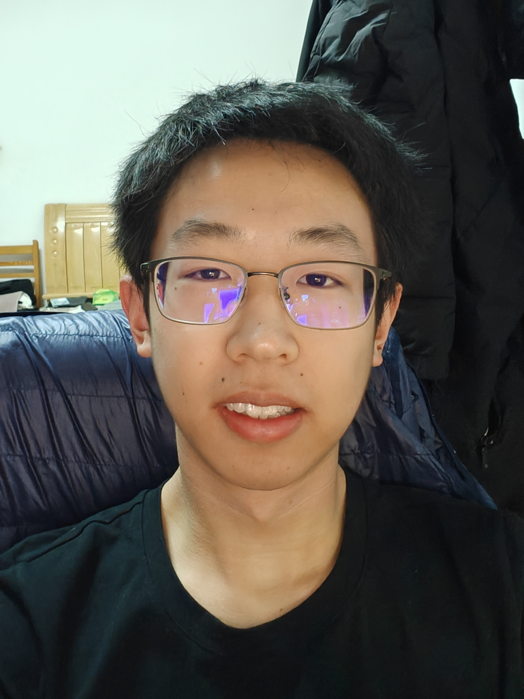

# Shengbin Guo (郭圣彬)

School of Science, Department of Frontier,
Harbin Institute of Technology, Shenzhen.

Email: shengbinguo2022\[AT\]gmail\[DOT\]com

---

## About me

I am currently a junior undergraduate student at **Harbin Institute of Technology, Shenzhen (HITSZ)**.

## Research interests

- AIGC
- World models
- Mutimodal-learning

## News

- **[2026-1]** 🎉🎉 Our paper ["Multimodal Dataset Distillation via Phased Teacher Models"](https://openreview.net/forum?id=Me4AON8160) was accepted to **ICLR 2026**!

## Honors & Awards
- **16th Lanqiao Cup Software Competition, National First Prize**, 2025.6
- **First-Class Academic Scholarship**, Harbin Institute of Technology (ShenZhen), 2023.10
