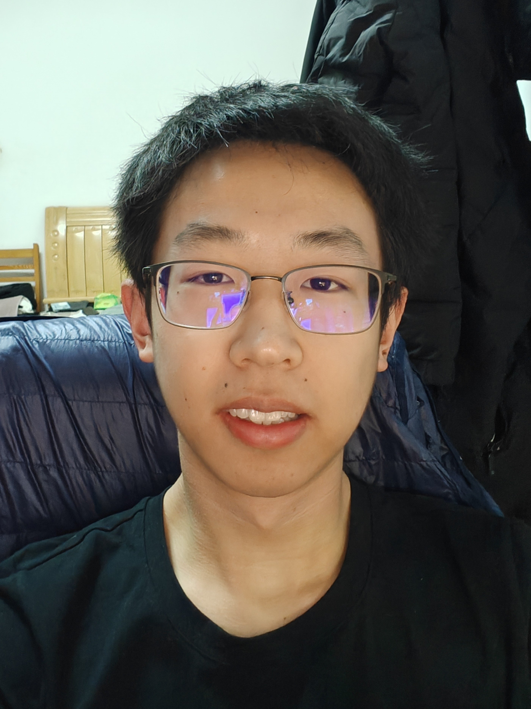

# Shengbin Guo (郭圣彬)

GitHub: [Previsior](https://github.com/Previsior)  
Email: [shengbinguo2022\[AT\]gmail\[DOT\]com](mailto:shengbinguo2022@gmail.com)

---

## About me

I am currently a M.S. Student at **School of Intelligence Science and Technology, Nanjing University**.  
In addition to studying AI, I also have a wide range of reading interests, including basic philosophy and various subject areas.  
Here is my record site: [About-the-Tao](https://about-the-tao.vercel.app/).

## Experience

- **Sep. 2026 - Jun. 2029 (expected)**, M.S. Student, School of Intelligence Science and Technology, Nanjing University.
- **Feb. 2026 - Present**, Research Intern, Shanghai Artificial Intelligence Laboratory.
- **Aug. 2022 - Jun. 2026**, B.S. Student, College of Frontier Sciences, Harbin Institute of Technology, Shenzhen.
- **Sep. 2019 - Jun. 2022**, Student, Tangshan No. 1 High School, Hebei Province.

## Research interests

- AIGC
- World models
- Mutimodal-learning

## News

- **[2026-6]** 🎉 Our paper ["PhyEditBench: A Real-World Multi-Stage Benchmark for Physics-Aware Image Editing"](https://github.com/Previsior/PhyEditBench) was accepted to **ECCV 2026**!
- **[2026-1]** 🎉 Our paper ["Multimodal Dataset Distillation via Phased Teacher Models"](https://github.com/Previsior/PTM-ST) was accepted to **ICLR 2026**!

## Honors & Awards
- **16th Lanqiao Cup Software Competition, National First Prize**, 2025.6
- **First-Class Academic Scholarship**, Harbin Institute of Technology (ShenZhen), 2023.10
- **Mathematical Contest in Modeling, Honorable Mention**, 2025.5
